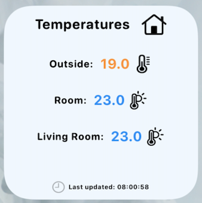

# 3 Temperatures Widget

## Setup

The "User Config Connection" section must be edited with the username, password and IP.
Remember that the user must use character encoding. Please see [Character Encoding ](https://grox.net/utils/encoding.html)

Edit the names of the titles and the names of the items, equal to those defined in OpenHAB.

## Credits

Modification of [m33x@Github](https://gist.github.com/m33x/62f6e8f6eab546e4b3a854695ea8c3a8)

## Support

